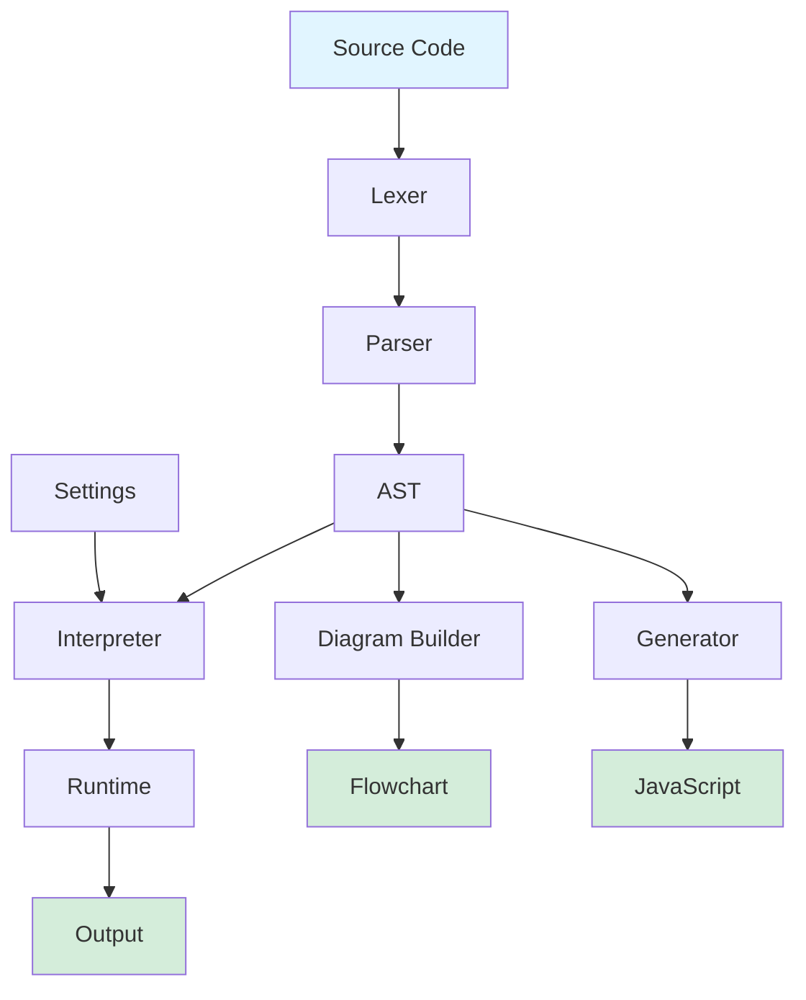

<div align="center">

# 🎓 Codoritmo

**A modern, browser-based pseudocode workspace for learning programming**

[](https://creativecommons.org/licenses/by-nc/4.0/)
[](https://nextjs.org/)
[](https://www.typescriptlang.org/)
[](CONTRIBUTING.md)

[📖 Documentation](docs/) • [🐛 Report Bug](../../issues) • [✨ Request Feature](../../issues)

</div>

---

## About

Codoritmo is an independent browser-based pseudocode workspace inspired by [PSeInt](http://pseint.sourceforge.net/). It provides a modern, accessible environment for learning programming fundamentals using a PSeInt-compatible dialect.

**Mission**: Make pseudocode programming accessible to everyone, directly in the browser, with no installation required.

> **Note**: While inspired by PSeInt's educational approach and maintaining compatibility with its dialect, Codoritmo is an independent project that may evolve in different directions over time.

## Key Features

- **Browser-based**: No installation required, works entirely in your web browser
- **PSeInt-compatible**: Supports PSeInt syntax, settings, and language constructs
- **Modern editor**: Monaco-powered code editor with syntax highlighting
- **Flowchart visualization**: Generate flowcharts from your pseudocode
- **Bilingual**: Full support for English and Spanish
- **Educational focus**: Designed for learning programming fundamentals
- **School profiles**: 385+ pre-configured PSeInt school profiles
- **Customizable**: Adjust settings to match your learning style

## Relationship to PSeInt

Codoritmo is inspired by [PSeInt](http://pseint.sourceforge.net/), an excellent educational tool created to help Spanish-speaking students learn programming. While Codoritmo maintains compatibility with PSeInt's dialect and honors its educational mission, it is a **separate, independent project**.

**For the official PSeInt desktop application**, visit: [http://pseint.sourceforge.net/](http://pseint.sourceforge.net/)

## Development Philosophy

This project is about **learning and shipping**. Nothing is more exciting than building, whether by hand or AI-assisted. Any PRs are welcome. Pride aside.

**Critical Thinking First**: Teaching algorithmic thinking and problem-solving. Writing code is secondary.

**Built with AI**: Developed using AI-assisted tools (Codex/Kiro).

**Iteration over Perfection**: Ship early, gather feedback, improve continuously.

**Accessible Contribution**: A PR from an elementary student using AI is as valuable as one from a veteran engineer.

## Getting Started

### Prerequisites

- Node.js 18 or higher
- npm, yarn, pnpm, or bun

### Installation

```bash
# Clone the repository
git clone https://github.com/yourusername/codoritmo.git
cd codoritmo

# Install dependencies
npm install

# Set up environment variables (optional)
cp .env.example .env.local
# Edit .env.local with your configuration
```

### Development

Run the development server:

```bash
npm run dev
```

Open [http://localhost:3000](http://localhost:3000) in your browser to see the application.

### Building for Production

```bash
# Build the application
npm run build

# Start the production server
npm start
```

### Running Tests

```bash
# Run all tests
npm test

# Run tests in watch mode
npm test:watch

# Run linting
npm run lint
```

## Project Structure

```
codoritmo/
├── app/                    # Next.js app router pages and layouts
├── src/
│   ├── engine/            # Pseudocode interpreter, parser, and code generator
│   ├── components/ide/    # IDE components (editor, workspace, panels)
│   ├── diagram/           # Flowchart generation and visualization
│   ├── i18n/              # Internationalization (English and Spanish)
│   └── seo/               # SEO and structured data
├── fixtures/              # Test fixtures and example programs
├── public/                # Static assets
└── scripts/               # Build and utility scripts
```

## Engine Architecture



**Execution Flow:**

1. **Lexer**: Tokenizes the source code
2. **Parser**: Builds the Abstract Syntax Tree (AST)
3. **Interpreter**: Executes the AST with the runtime
4. **Runtime**: Manages variables, I/O, and execution state
5. **Diagram Builder**: Converts the AST into visual flowcharts
6. **Generator**: Converts the AST into executable JavaScript code

## Technology Stack

- **Framework**: [Next.js 16](https://nextjs.org/) with App Router
- **Language**: [TypeScript 5](https://www.typescriptlang.org/)
- **Editor**: [Monaco Editor](https://microsoft.github.io/monaco-editor/)
- **Styling**: [Tailwind CSS 4](https://tailwindcss.com/)
- **Diagrams**: [React Flow](https://reactflow.dev/) with [ELK.js](https://eclipse.dev/elk/)
- **Testing**: [Jest](https://jestjs.io/) + [React Testing Library](https://testing-library.com/react)
- **Animation**: [Motion](https://motion.dev/)

## Environment Variables

Create a `.env.local` file in the root directory:

```env
# Site URL (used for SEO, sitemaps, and canonical URLs)
NEXT_PUBLIC_SITE_URL=https://your-domain.com
```

## Roadmap

Future features depend on user feedback and requests. Potential additions include:

- **User accounts** — Save your work across sessions and devices
- **Code sharing** — Share programs with classmates and teachers via links
- **Profile sharing** — Export and import custom school profiles
- **Collaborative editing** — Work on programs together in real-time
- **Assignment system** — Teachers can create and distribute exercises
- **Progress tracking** — Track learning progress and completed exercises
- **Leaderboards** — Friendly competition and achievement recognition
- **Badges and achievements** — Gamification to motivate learning
- **Code snippets library** — Save and reuse common patterns
- **Embedded mode** — Embed the editor in educational websites
- **Mobile app** — Native mobile experience for tablets and phones

Have a feature request? [Open an issue](../../issues) and let us know what would help you learn better.

## Contributing

Contributions are welcome! We appreciate your help in making Codoritmo better.

**All Contributors Welcome** — Whether you're an elementary student with an AI editor or a seasoned engineer with decades of experience, your contributions are equally valuable. This project is about making coding accessible, and that includes making contributing accessible too.

### How to Contribute

1. Fork the repository
2. Create a feature branch (`git checkout -b feature/amazing-feature`)
3. Commit your changes (`git commit -m 'Add some amazing feature'`)
4. Push to the branch (`git push origin feature/amazing-feature`)
5. Open a Pull Request

**Don't be intimidated!** If you're learning and want to contribute with the help of AI tools, that's not just okay—it's encouraged. We value the contribution, not the method.

Please read [CONTRIBUTING.md](CONTRIBUTING.md) for details on our code of conduct and development process.

### Development Guidelines

- Write tests for new features
- Follow the existing code style
- Update documentation as needed
- Ensure all tests pass before submitting PR
- Use whatever tools help you contribute effectively (AI assistants included!)

## License

This project is licensed under the **Creative Commons Attribution-NonCommercial 4.0 International License (CC BY-NC 4.0)**.

**You are free to:**

- Share — copy and redistribute the material
- Adapt — remix, transform, and build upon the material

**Under these terms:**

- **Attribution** — You must give appropriate credit
- **NonCommercial** — You may not use the material for commercial purposes

See the [LICENSE](LICENSE) file for full details or visit [https://creativecommons.org/licenses/by-nc/4.0/](https://creativecommons.org/licenses/by-nc/4.0/)

## Acknowledgments

**This project wouldn't exist without [PSeInt](http://pseint.sourceforge.net/).**

PSeInt, created by Pablo Novara, has been instrumental in teaching programming to Spanish-speaking students for over a decade. It pioneered the use of pseudocode in Spanish for education, making programming accessible to millions of students. Codoritmo stands on the shoulders of that incredible work.

Visit the official PSeInt project: [http://pseint.sourceforge.net/](http://pseint.sourceforge.net/)

Special thanks also to:

- All contributors who help improve Codoritmo
- The open source community for the amazing tools that make this project possible

## Support

- [Documentation](docs/)
- [Issue Tracker](../../issues)
- [Discussions](../../discussions)

---

<div align="center">

**Made with ❤️ for students learning programming**

[⭐ Star this repo](../../stargazers) • [🍴 Fork it](../../fork) • [📢 Share it](https://twitter.com/intent/tweet?text=Check%20out%20Codoritmo%20-%20A%20modern%20browser-based%20pseudocode%20workspace!&url=https://github.com/yourusername/codoritmo)

</div>
