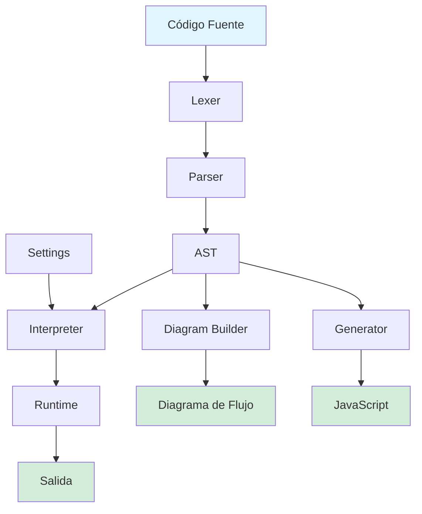

<div align="center">

# 🎓 Codoritmo

**Un espacio de trabajo moderno de pseudocódigo en el navegador para aprender programación**

[](https://creativecommons.org/licenses/by-nc/4.0/)
[](https://nextjs.org/)
[](https://www.typescriptlang.org/)
[](CONTRIBUTING.md)

[🚀 Versión en Vivo](https://www.codoritmo.com) • [📖 Documentación](docs/) • [🐛 Reportar Error](../../issues) • [✨ Solicitar Función](../../issues) • [🇬🇧 English](README.en.md)

</div>

---

## Acerca de

Codoritmo es un espacio de trabajo de pseudocódigo independiente basado en navegador, inspirado en [PSeInt](http://pseint.sourceforge.net/). Proporciona un entorno moderno y accesible para aprender fundamentos de programación usando un dialecto compatible con PSeInt.

**Misión**: Hacer la programación con pseudocódigo accesible para todos, directamente en el navegador, sin necesidad de instalación.

> **Nota**: Aunque está inspirado en el enfoque educativo de PSeInt y mantiene compatibilidad con su dialecto, Codoritmo es un proyecto independiente que puede evolucionar en diferentes direcciones con el tiempo.

## Características Principales

- **Basado en navegador**: No requiere instalación, funciona completamente en tu navegador web
- **Compatible con PSeInt**: Soporta sintaxis, configuraciones y construcciones del lenguaje PSeInt
- **Editor moderno**: Editor de código con resaltado de sintaxis basado en Monaco
- **Visualización de diagramas de flujo**: Genera diagramas de flujo desde tu pseudocódigo
- **Bilingüe**: Soporte completo para español e inglés
- **Enfoque educativo**: Diseñado para aprender fundamentos de programación
- **Perfiles escolares**: Más de 385 perfiles escolares de PSeInt preconfigurados
- **Personalizable**: Ajusta la configuración según tu estilo de aprendizaje

## Relación con PSeInt

Codoritmo está inspirado en [PSeInt](http://pseint.sourceforge.net/), una excelente herramienta educativa creada para ayudar a estudiantes hispanohablantes a aprender programación. Aunque Codoritmo mantiene compatibilidad con el dialecto de PSeInt y honra su misión educativa, es un **proyecto separado e independiente**.

**Para la aplicación oficial de escritorio PSeInt**, visita: [http://pseint.sourceforge.net/](http://pseint.sourceforge.net/)

## Filosofía de Desarrollo

Este proyecto se trata de **aprender y lanzar**. No hay nada más emocionante que construir, ya sea a mano o asistido por IA. Cualquier PR es bienvenido. El orgullo a un lado.

**Pensamiento Crítico Primero**: Enseñar pensamiento algorítmico y resolución de problemas. Escribir código es secundario.

**Construido con IA**: Desarrollado usando herramientas asistidas por IA (Codex/Kiro).

**Iteración sobre Perfección**: Lanzar temprano, recopilar retroalimentación, mejorar continuamente.

**Contribución Accesible**: Un PR de un estudiante de primaria usando IA es tan valioso como uno de un ingeniero veterano.

## Comenzando

### Requisitos Previos

- Node.js 18 o superior
- npm, yarn, pnpm, o bun

### Instalación

```bash
# Clonar el repositorio
git clone https://github.com/yourusername/codoritmo.git
cd codoritmo

# Instalar dependencias
npm install

# Configurar variables de entorno (opcional)
cp .env.example .env.local
# Editar .env.local con tu configuración
```

### Desarrollo

Ejecutar el servidor de desarrollo:

```bash
npm run dev
```

Abre [http://localhost:3000](http://localhost:3000) en tu navegador para ver la aplicación.

### Compilar para Producción

```bash
# Compilar la aplicación
npm run build

# Iniciar el servidor de producción
npm start
```

### Ejecutar Pruebas

```bash
# Ejecutar todas las pruebas
npm test

# Ejecutar pruebas en modo observación
npm test:watch

# Ejecutar linting
npm run lint
```

## Estructura del Proyecto

```
codoritmo/
├── app/                    # Páginas y layouts del app router de Next.js
├── src/
│   ├── engine/            # Intérprete de pseudocódigo, parser y generador de código
│   ├── components/ide/    # Componentes del IDE (editor, workspace, paneles)
│   ├── diagram/           # Generación y visualización de diagramas de flujo
│   ├── i18n/              # Internacionalización (español e inglés)
│   └── seo/               # SEO y datos estructurados
├── fixtures/              # Fixtures de prueba y programas de ejemplo
├── public/                # Recursos estáticos
└── scripts/               # Scripts de compilación y utilidades
```

## Arquitectura del Motor



**Flujo de Ejecución:**

1. **Lexer**: Tokeniza el código fuente
2. **Parser**: Construye el Árbol de Sintaxis Abstracta (AST)
3. **Interpreter**: Ejecuta el AST con el runtime
4. **Runtime**: Maneja variables, entrada/salida y estado de ejecución
5. **Diagram Builder**: Convierte el AST en diagramas de flujo visuales
6. **Generator**: Convierte el AST en código JavaScript ejecutable

## Stack Tecnológico

- **Framework**: [Next.js 16](https://nextjs.org/) con App Router
- **Lenguaje**: [TypeScript 5](https://www.typescriptlang.org/)
- **Editor**: [Monaco Editor](https://microsoft.github.io/monaco-editor/)
- **Estilos**: [Tailwind CSS 4](https://tailwindcss.com/)
- **Diagramas**: [React Flow](https://reactflow.dev/) con [ELK.js](https://eclipse.dev/elk/)
- **Pruebas**: [Jest](https://jestjs.io/) + [React Testing Library](https://testing-library.com/react)
- **Animación**: [Motion](https://motion.dev/)

## Variables de Entorno

Crea un archivo `.env.local` en el directorio raíz:

```env
# URL del sitio (usado para SEO, sitemaps y URLs canónicas)
NEXT_PUBLIC_SITE_URL=https://tu-dominio.com
```

## Hoja de Ruta

Las funciones futuras dependen de la retroalimentación y solicitudes de los usuarios. Las adiciones potenciales incluyen:

- **Cuentas de usuario**: Guarda tu trabajo entre sesiones y dispositivos
- **Compartir código**: Comparte programas con compañeros y profesores mediante enlaces
- **Compartir perfiles**: Exporta e importa perfiles escolares personalizados
- **Edición colaborativa**: Trabaja en programas juntos en tiempo real
- **Sistema de tareas**: Los profesores pueden crear y distribuir ejercicios
- **Seguimiento de progreso**: Rastrea el progreso de aprendizaje y ejercicios completados
- **Tablas de clasificación**: Competencia amistosa y reconocimiento de logros
- **Insignias y logros**: Gamificación para motivar el aprendizaje
- **Biblioteca de fragmentos de código**: Guarda y reutiliza patrones comunes
- **Modo embebido**: Incrusta el editor en sitios web educativos
- **Aplicación móvil**: Experiencia móvil nativa para tabletas y teléfonos

¿Tienes una solicitud de función? [Abre un issue](../../issues) y cuéntanos qué te ayudaría a aprender mejor.

## Contribuir

¡Las contribuciones son bienvenidas! Apreciamos tu ayuda para mejorar Codoritmo.

**Todos los Contribuyentes son Bienvenidos**: Ya seas un estudiante de primaria con un editor de IA o un ingeniero experimentado con décadas de experiencia, tus contribuciones son igualmente valiosas. Este proyecto trata sobre hacer la programación accesible, y eso incluye hacer la contribución accesible también.

### Cómo Contribuir

1. Haz un fork del repositorio
2. Crea una rama de función (`git checkout -b feature/funcion-increible`)
3. Haz commit de tus cambios (`git commit -m 'Agregar alguna función increíble'`)
4. Haz push a la rama (`git push origin feature/funcion-increible`)
5. Abre un Pull Request

**¡No te intimides!** Si estás aprendiendo y quieres contribuir con la ayuda de herramientas de IA, eso no solo está bien, está alentado. Valoramos la contribución, no el método.

Lee [CONTRIBUTING.md](CONTRIBUTING.md) para detalles sobre nuestro código de conducta y proceso de desarrollo.

### Guías de Desarrollo

- Escribe pruebas para nuevas funciones
- Sigue el estilo de código existente
- Actualiza la documentación según sea necesario
- Asegúrate de que todas las pruebas pasen antes de enviar el PR
- ¡Usa las herramientas que te ayuden a contribuir efectivamente (asistentes de IA incluidos)!

## Licencia

Este proyecto está licenciado bajo la **Licencia Creative Commons Atribución-NoComercial 4.0 Internacional (CC BY-NC 4.0)**.

**Eres libre de:**

- Compartir: copiar y redistribuir el material
- Adaptar: remezclar, transformar y construir sobre el material

**Bajo estos términos:**

- **Atribución**: Debes dar el crédito apropiado
- **NoComercial**: No puedes usar el material con fines comerciales

Consulta el archivo [LICENSE](LICENSE) para más detalles o visita [https://creativecommons.org/licenses/by-nc/4.0/](https://creativecommons.org/licenses/by-nc/4.0/)

## Agradecimientos

**Este proyecto no existiría sin [PSeInt](http://pseint.sourceforge.net/).**

PSeInt, creado por Pablo Novara, ha sido fundamental para enseñar programación a estudiantes hispanohablantes durante más de una década. Fue pionero en el uso de pseudocódigo en español para la educación, haciendo la programación accesible a millones de estudiantes. Codoritmo se apoya en los hombros de ese increíble trabajo.

Visita el proyecto oficial de PSeInt: [http://pseint.sourceforge.net/](http://pseint.sourceforge.net/)

Agradecimientos especiales también a:

- Todos los contribuyentes que ayudan a mejorar Codoritmo
- La comunidad de código abierto por las increíbles herramientas que hacen posible este proyecto

## Soporte

- [Documentación](docs/)
- [Rastreador de Issues](../../issues)
- [Discusiones](../../discussions)

---

<div align="center">

**Hecho con ❤️ para estudiantes aprendiendo programación**

[⭐ Dale estrella a este repo](../../stargazers) • [🍴 Haz un fork](../../fork) • [📢 Compártelo](https://twitter.com/intent/tweet?text=¡Mira%20Codoritmo%20-%20Un%20espacio%20de%20trabajo%20moderno%20de%20pseudocódigo%20en%20el%20navegador!&url=https://github.com/yourusername/codoritmo)

</div>
